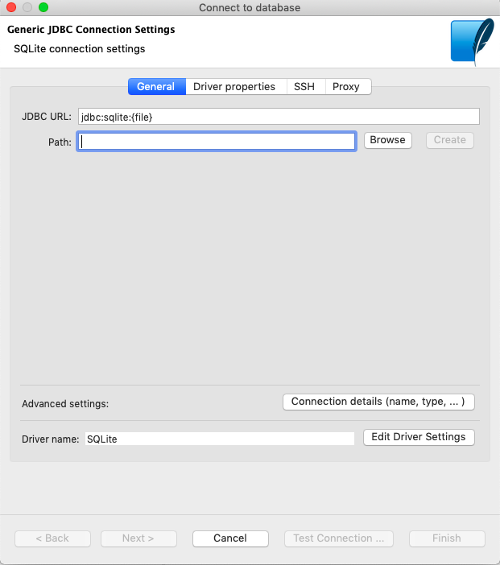
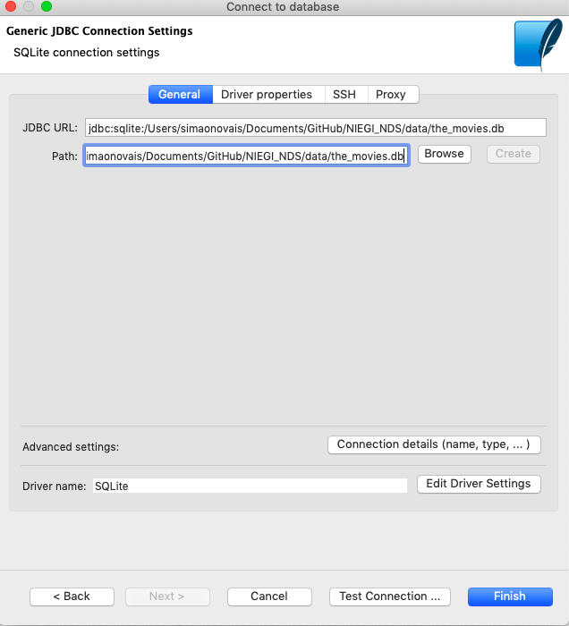
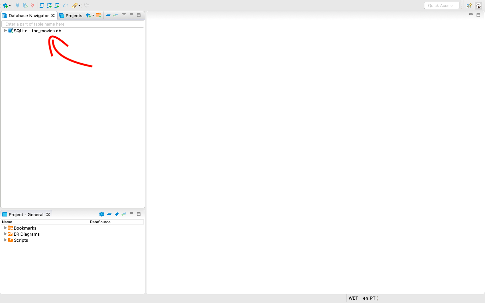
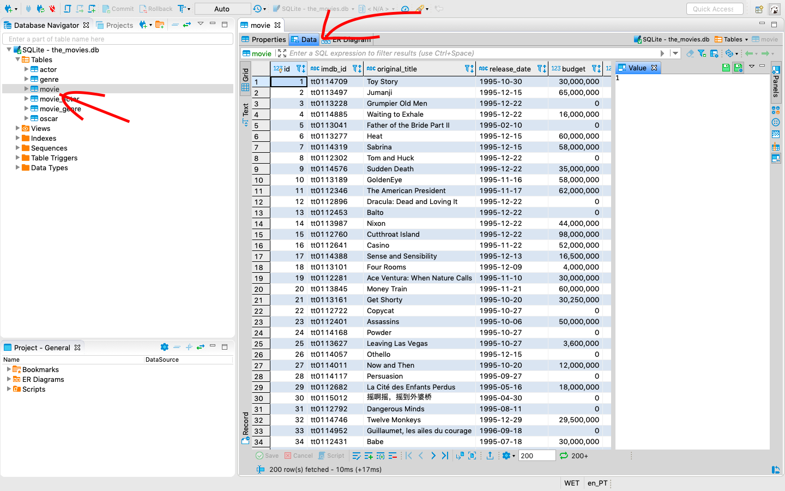
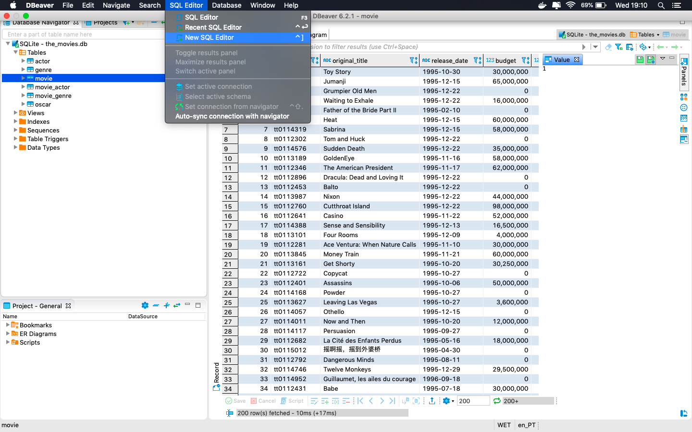
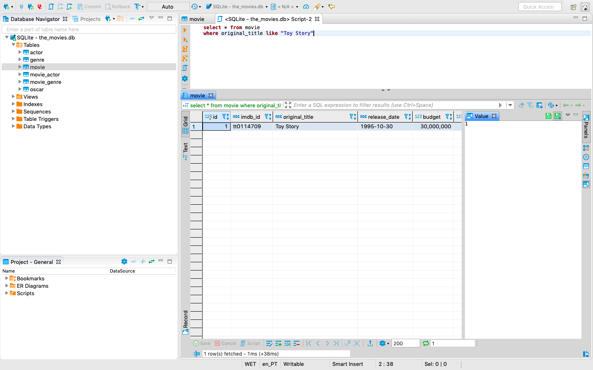

# Workshop-NEM-NDS-database

Welcome! In order to provide you with the best experience we ask that you complete this tutorial before attending the workshop.    
**Questions**: In case you encounter any difficulties following the tutorial, you can ask questions directly to our guys at [NDS](https://www.facebook.com/NDS-Núcleo-de-Data-Science-FCT-UNL-769904580035480/) through the messsenger chat.

# Tutorial
Time to interact with a real database! For this course we will connect to an SQLite database, which is just a file! You can read more about that [here](https://www.sqlite.org/onefile.html).
For this, we'll need an SQL client, which is a graphical interface to interact with the database. So let's install a SQL client and get started!

Here we're going to use the `DBeaver SQL client` since it can work with different DBMSs and can be installed in Linux, Mac and Windows machines.

#### Step 1: Download and Install DBeaver client

This tutorial was created for version 7.1.1 of DBeaver, despite the most recent version being 7.2.5. We will use this version because it's fairly recent still, and matches the screenshots of the tutorial.

[Download Link for DBeaver 7.1.1](https://dbeaver.io/files/7.1.1/). 

The file you should download depends on your operating system:
- `windows`: you are probably looking for *dbeaver-ce-7.1.1-x86_64-setup.exe*
- `mac`: you are probably looking for *dbeaver-ce-7.1.1-macos.dmg*
- `linux`: you probably know what to do if you use linux.

#### Step 1.2: Download database

We prepared two databases for this workshop. You can find them at this repository. Follow the steps on the image below to download the databases and then continue this tutorial. You jsut have to click those 2 buttons.

#### Step 2: Connect to local database

Do you remember where you saved the database files in your computer? Good! Because we are going to need them.

Notice that there is a file named `the_movies.db`. That's one of the databases. Let's connect to it!

If you open your DBeaver app, you should get something similar to the following image (except the main center window that is showing a error, that's my bad):

Now we want to create a new (SQLite) connection to our database!

This window should have popped up:

DBeaver is asking you to provide the full path on your computer of the database file. You should now press "browse" and find the the_movies.db file which is inside the workshop folder under "data": (you can see where mine is stored below, but your path is probably slightly different)

You can now press "Finish" and this should be what you get:

#### Step 3: Investigate the DB

You can now start looking at what's inside our database! We will let you explore this by yourself but here's already a couple of things that you can do:

Awesome! So you can actually see what types of columns each table has and even look directly at the data!

#### Step 4: Test a query

Select "SQL Editor" in the tool-bar and then click on "New SQL editor".

Type "SELECT * FROM movie where original_title like 'Toy Story';" and check that you get the results (press CTRL+Enter or click the orange arrow to execute SQL statements)

----

Congratulations you have completed the DBeaver tutorial! You may now have your well deserved rest and patiently wait until workshop day. See you there!

